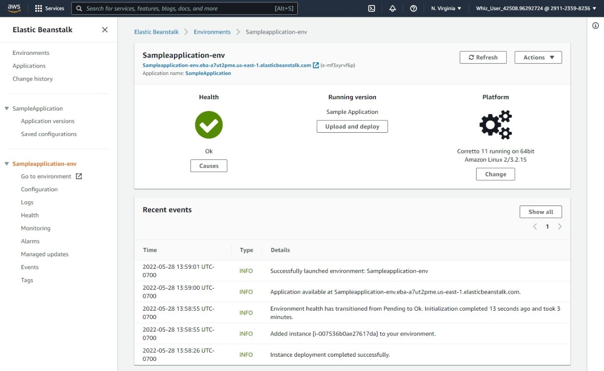
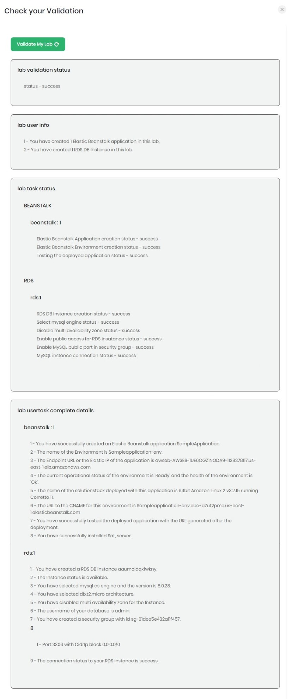

<h1 align="center">
Whizlabs Challenge League
</h1>

<h2 align="center">
Challenge Lab Two

Elastic Beanstalk and RDS
</h2>

---

Whizlabs is running a cloud challenge between May and July 2022.  The challenge is to complete various tasks in either AWS, GCP, or Azure to test cloud skills.  Following is my solution to challenge lab two.

---
<h3>From Whizlabs</h3>

Cloud Challenge Details

>In this lab challenge, your AWS Elastic Beanstalk, Amazon RDS MySQL and AWS EC2 skills are put to the test. You'll be given a requirement and you have to reach it using your knowledge of Amazon Elastic Beanstalk and other AWS services. The Lab Challenge helps you understand the real-time scenarios.\
>A company XYZ is deploying a new web application. As a part of the infrastructure, they need a database for their testing environment. Now your challenge is to deploy and manage a simple Java application in the AWS cloud and will add a new database using Beanstalk Environment Configuration. 
>In this lab challenge, your AWS Elastic Beanstalk, Amazon RDS MySQL and AWS EC2 skills are put to the test. You'll be given a requirement and you have to reach it using your knowledge of Amazon Elastic Beanstalk and other AWS services. The Lab Challenge helps you understand the real-time scenarios.
        A company XYZ is deploying a new web application. As a part of the infrastructure, they need a database for their testing environment. Now your challenge is to deploy and manage a simple Java application in the AWS cloud and will add a new database using Beanstalk Environment Configuration. 
>1.	Create an Elastic Beanstalk Application with Java platform.
>2.	After creation copy the application URL and paste it in browser to test the application
>3.	Add MySQL Database to Beanstalk Environment with
>     1.	Engine Version: 5.7.22
>     2. Instance class: db.t2.micro
>     3.	Storage: 5GB
>     4.	Enter Username and Password
>     5.	Retention: Choose Delete
>     6.	Availability: Choose Low (one AZ)
>4.	Edit Security group of RDS 
>     1. Click on DB identifier name and in VPC Security groups of RDS Edit inbound rules as Type: MySQL/Aurora and Source as Anywhere-IPv4
>5.	Test the RDS Database Connection by using RDS Endpoint 
>6.	Connect RDS Endpoint from local Linux/ios machine using syntax: mysql -u <username> -p -h <rds endpoint>
>7.	Connect RDS Endpoint from local windows machine using MySQL Workbench by clicking on MySQL Connections 
>     1.	Connection name: Enter Beanstalk Database
>     1.	Connection method: Select Standard (TCP/IP)
>     2.	Hostname: Enter Database Endpoint
>     3.	Port: Enter 3306
>     4.	Username: Enter Username
>     5.	Password: Enter Password

---

<h3>1. Create an Elastic Beanstalk application.</h3>

Login into AWS and search/choose *Elastic Beanstalk*.

In Elastic Beanstalk, click *Create Application*.

  

  

  

  

  

  

  

  

  

  

  

  

